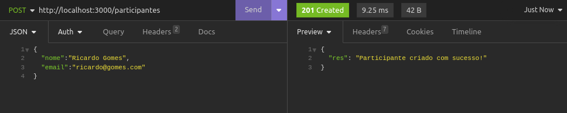
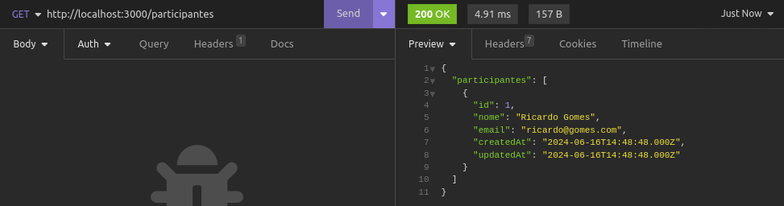
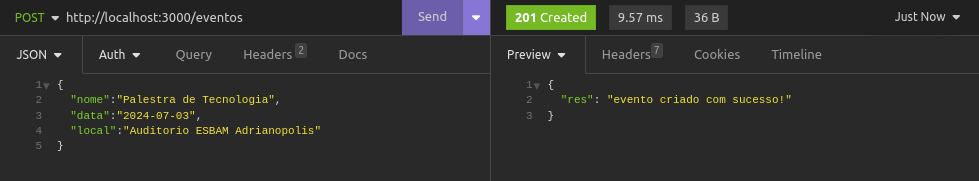
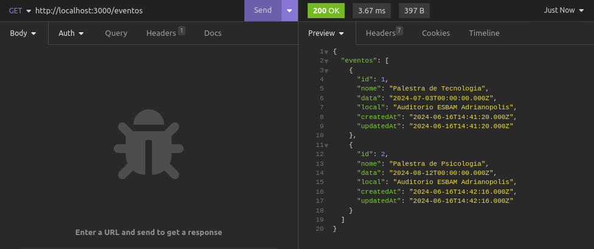
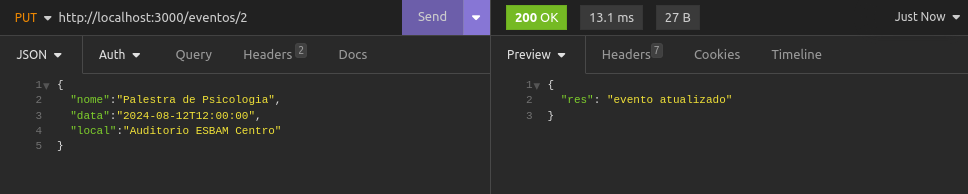
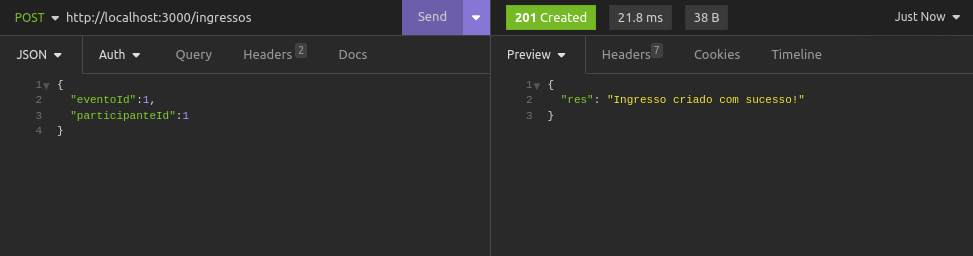
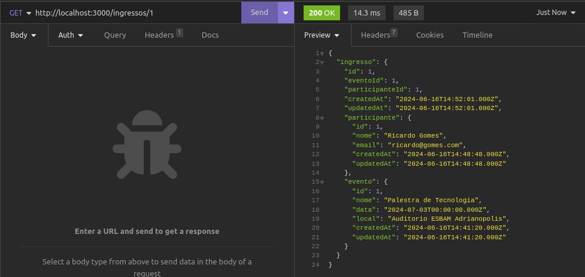

# API PARA CONTROLE DE INGRESSOS

O objetivo deste trabalho é desenvolver uma API para realizar o controle de ingressos
para eventos, o controle se dá por meio de 3 modelos, evento, participante e ingresso.

É possível realizar as operações de CRUD (create, read, update e delete) em todas as 3 models
do trabalho.

Evento: é possível criar um evento com nome, data e local.
Partipante: é possível criar um participante com nome e email.
Ingresso: o ingresso é criado utilizando a chave primária do evento e do participante.

## Uso API
### criando participantes:


### mostrando participantes:


### criando eventos:


### mostrando eventos:


### atualizando eventos:


### criando ingresso:


### mostrando dados de um ingresso:



## Rotas:

### Rotas de eventos
```
router.post('/eventos', eventoController.create);
router.get('/eventos', eventoController.showAll);
router.get('/eventos/:id', eventoController.show);
router.put('/eventos/:id', eventoController.update);
router.delete('/eventos/:id', eventoController.delete);
```

### Rotas de Participantes
```
router.post('/participantes', participantesController.create);
router.get('/participantes', participantesController.showAll);
router.get('/participantes/:id', participantesController.show);
router.put('/participantes/:id', participantesController.update);
router.delete('/participantes/:id', participantesController.delete);
```

### Rotas de Ingresso
```
router.post('/ingressos', ingressosController.create);
router.get('/ingressos', ingressosController.showAll);
router.get('/ingressos/:id', ingressosController.show);
router.put('/ingressos/:id', ingressosController.update);
router.delete('/ingressos/:id', ingressosController.delete);
```